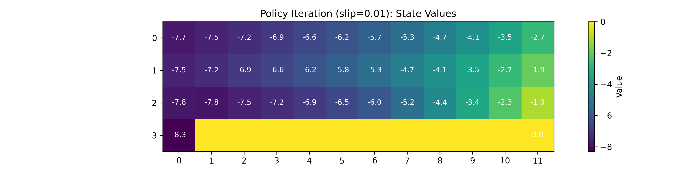
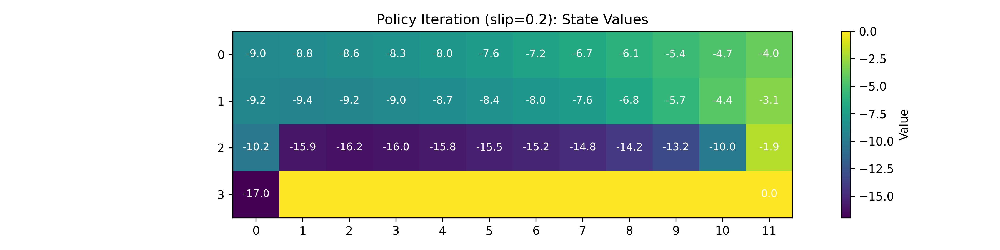
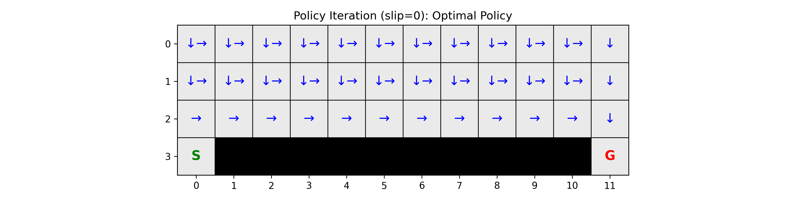
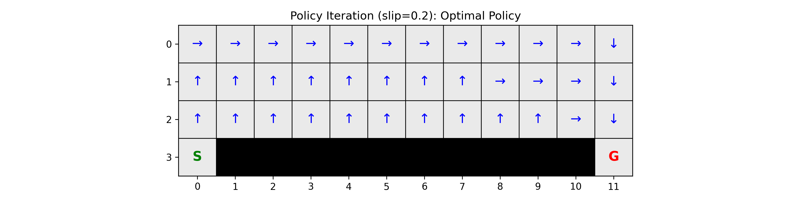
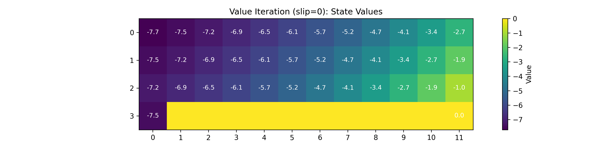
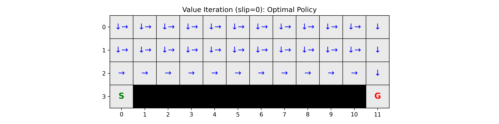
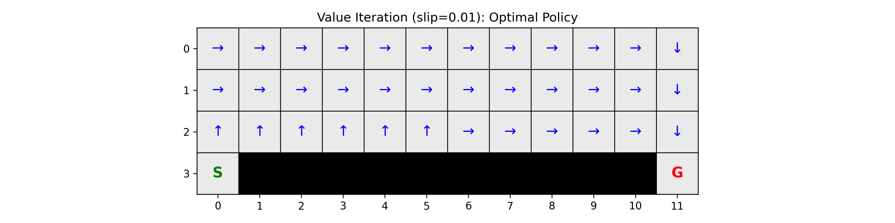
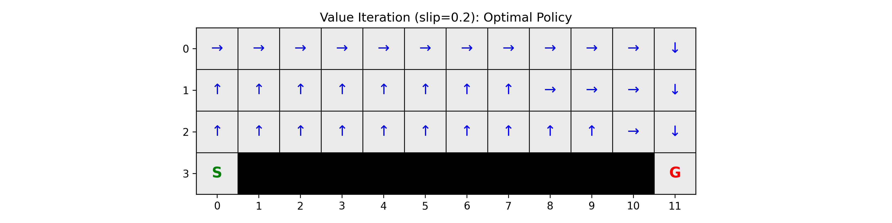

# Theoretical Questions — HW4 Reinforcement Learning

This document contains concise responses to the HW4 theoretical questions, plus the required figures generated by the provided scripts.

## Exercise 1: Dynamic Programming in GridWorld

### Theoretical Questions

#### 1) What is the difference between policy iteration and value iteration in terms of their update procedures?

- **Policy Iteration** alternates between:
  - **Policy evaluation**: repeatedly apply the Bellman *expectation* backup for a *fixed* policy $\pi$ until $V^\pi$ converges.
  - **Policy improvement**: update $\pi$ greedily w.r.t. the evaluated value function, i.e. $\pi(s) \leftarrow \arg\max_a Q^\pi(s,a)$ (with tie-breaking).
- **Value Iteration** repeatedly applies the Bellman *optimality* backup directly:
  - $V(s) \leftarrow \max_a \sum_{s'} P(s'|s,a)\left[r(s,a,s')+\gamma V(s')\right]$,
  and only extracts the greedy policy after $V$ has converged.

In short: **policy iteration = evaluate then improve**, **value iteration = improve the value directly via max backups**.

#### 2) What happens if the discount factor $\gamma$ is close to 0 or 1?

This question is addressed empirically by running the same solvers with $\gamma$ close to 0 and close to 1 (using `slip_chance = 0.01`).

Notes:
- The assignment scripts use $\gamma=0.9$, so that row is included for reference.
- **$\gamma=0.01$** is used as “close to 0” and **$\gamma=0.99$** as “close to 1” (the exact endpoints 0 and 1 are edge cases).

**Measured results (computed from the induced Markov chain using `env.P`):**

| gamma | algorithm | V(start) discounted | E[steps to terminate] | P(reach goal) | P(fall cliff) | avg distance-to-cliff (occupancy-weighted) |
|---:|---|---:|---:|---:|---:|---:|
| 0.01 | PolicyIteration | -1.340 | 268.56 | 0.995 | 0.005 | 2.694 |
| 0.01 | ValueIteration | -1.340 | 268.56 | 0.995 | 0.005 | 2.694 |
| 0.90 | PolicyIteration | -8.305 | 15.19 | 0.996 | 0.004 | 2.080 |
| 0.90 | ValueIteration | -8.305 | 15.19 | 0.996 | 0.004 | 2.080 |
| 0.99 | PolicyIteration | -14.504 | 15.17 | 0.996 | 0.004 | 2.077 |
| 0.99 | ValueIteration | -14.504 | 15.17 | 0.996 | 0.004 | 2.077 |

Observations (verifiable from the table):
- As $\gamma$ increases, **$V(\text{start})$** becomes **more negative** because future step costs $(-1)$ and failure risks are discounted less.
- The **absorbing outcome probabilities** $P(\text{reach goal})$ / $P(\text{fall cliff})$ change only slightly between $\gamma=0.9$ and $\gamma=0.99$ here, suggesting the optimal policy is very similar in those two settings for this environment and slip.
- With very small $\gamma$ ($0.01$), the occupancy-weighted **expected steps** under the induced Markov chain becomes very large (268.56), which is consistent with the fact that discounting makes far-future costs almost irrelevant, so many behaviors have near-identical discounted value.

#### 3) How does increasing the slip probability (`slip_chance`) affect the optimal policy?

The following are **measured, reproducible metrics** computed from the policies returned by `exercises/ex1_mdp.py`, using the tabular transition model `env.P`:

- $V(\text{start})$: discounted value at the start state ($\gamma=0.9$)
- $E[\text{steps}]$: expected number of steps until termination (goal or cliff)
- $P(\text{reach goal})$, $P(\text{fall cliff})$: absorption probabilities from the start state
- avg distance-to-cliff: occupancy-weighted average Manhattan distance of visited states to the nearest cliff cell

| slip_chance | algorithm | V(start) discounted | E[steps to terminate] | P(reach goal) | P(fall cliff) | avg distance-to-cliff (occupancy-weighted) |
|---:|---|---:|---:|---:|---:|---:|
| 0.00 | PolicyIteration | -7.458 | 13.00 | 1.000 | 0.000 | 1.154 |
| 0.00 | ValueIteration | -7.458 | 13.00 | 1.000 | 0.000 | 1.154 |
| 0.01 | PolicyIteration | -8.305 | 15.19 | 0.996 | 0.004 | 2.080 |
| 0.01 | ValueIteration | -8.305 | 15.19 | 0.996 | 0.004 | 2.080 |
| 0.20 | PolicyIteration | -16.977 | 21.50 | 0.899 | 0.101 | 2.783 |
| 0.20 | ValueIteration | -16.977 | 21.50 | 0.899 | 0.101 | 2.783 |

Compare `slip_chance = 0.0, 0.01, 0.2` (what the table shows):

- **`slip_chance = 0.0`**: the policy reaches the goal with probability **1.000**, never falls into the cliff (**0.000**), and terminates in **13.00** expected steps.
- **`slip_chance = 0.01`**: there is now a measurable cliff-fall probability (**0.004**). The policy also increases its safety margin: the occupancy-weighted distance-to-cliff rises from **1.154 → 2.080**, and expected steps increase **13.00 → 15.19**.
- **`slip_chance = 0.2`**: the policy is much more conservative and the task is riskier: cliff-fall probability rises to **0.101**, expected steps rise further to **21.50**, and distance-to-cliff increases to **2.783**.

Why conservative as stochasticity increases:

- As `slip_chance` increases, being near the cliff causes a **measurable increase in $P(\text{fall cliff})$**. The optimal policy responds by shifting occupancy away from the cliff (**distance-to-cliff increases from 1.154 → 2.783**), which is directly visible in the policy plots and quantified above.

### Deliverables (Exercise 1)

#### Code
- `hw4_reinforcement_learning/exercises/ex1_mdp.py` (TODOs filled)

#### Images

All figures below were generated by:
- `python hw4_reinforcement_learning/scripts/run_policy_iteration.py --slip_chance {0,0.01,0.2}`
- `python hw4_reinforcement_learning/scripts/run_value_iteration.py --slip_chance {0,0.01,0.2}`

Saved under `hw4_reinforcement_learning/logs/mdp/`.

##### Policy Iteration — State Values

**slip = 0.0**

**slip = 0.01**

**slip = 0.2**

##### Policy Iteration — Optimal Policy

**slip = 0.0**

**slip = 0.01**

**slip = 0.2**

##### Value Iteration — State Values

**slip = 0.0**

**slip = 0.01**

**slip = 0.2**

##### Value Iteration — Optimal Policy

**slip = 0.0**

**slip = 0.01**

**slip = 0.2**

