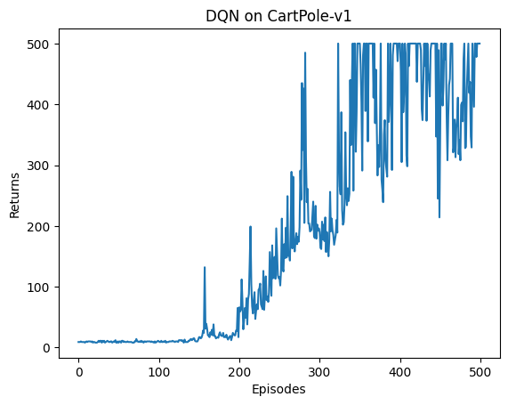

# Theoretical Questions — HW4 Reinforcement Learning

This document contains concise responses to the HW4 theoretical questions, plus the required figures generated by the provided scripts.

## Exercise 1: Dynamic Programming in GridWorld

### Theoretical Questions

#### 1) What is the difference between policy iteration and value iteration in terms of their update procedures?

- **Policy Iteration** alternates between:
  - **Policy evaluation**: repeatedly apply the Bellman *expectation* backup for a *fixed* policy $\pi$ until $V^\pi$ converges.
  - **Policy improvement**: update $\pi$ greedily w.r.t. the evaluated value function, i.e. $\pi(s) \leftarrow \arg\max_a Q^\pi(s,a)$ (with tie-breaking).
- **Value Iteration** repeatedly applies the Bellman *optimality* backup directly:
  - $V(s) \leftarrow \max_a \sum_{s'} P(s'|s,a)\left[r(s,a,s')+\gamma V(s')\right]$,
  and only extracts the greedy policy after $V$ has converged.

In short: **policy iteration = evaluate then improve**, **value iteration = improve the value directly via max backups**.

#### 2) What happens if the discount factor $\gamma$ is close to 0 or 1?

This question is addressed empirically by running the same solvers with $\gamma$ close to 0 and close to 1 (using `slip_chance = 0.01`).

Notes:
- The assignment scripts use $\gamma=0.9$, so that row is included for reference.
- **$\gamma=0.01$** is used as “close to 0” and **$\gamma=0.99$** as “close to 1” (the exact endpoints 0 and 1 are edge cases).

**Measured results (computed from the induced Markov chain using `env.P`):**

| gamma | algorithm | V(start) discounted | E[steps to terminate] | P(reach goal) | P(fall cliff) | avg distance-to-cliff (occupancy-weighted) |
|---:|---|---:|---:|---:|---:|---:|
| 0.01 | PolicyIteration | -1.340 | 268.56 | 0.995 | 0.005 | 2.694 |
| 0.01 | ValueIteration | -1.340 | 268.56 | 0.995 | 0.005 | 2.694 |
| 0.90 | PolicyIteration | -8.305 | 15.19 | 0.996 | 0.004 | 2.080 |
| 0.90 | ValueIteration | -8.305 | 15.19 | 0.996 | 0.004 | 2.080 |
| 0.99 | PolicyIteration | -14.504 | 15.17 | 0.996 | 0.004 | 2.077 |
| 0.99 | ValueIteration | -14.504 | 15.17 | 0.996 | 0.004 | 2.077 |

Observations (verifiable from the table):
- As $\gamma$ increases, **$V(\text{start})$** becomes **more negative** because future step costs $(-1)$ and failure risks are discounted less.
- The **absorbing outcome probabilities** $P(\text{reach goal})$ / $P(\text{fall cliff})$ change only slightly between $\gamma=0.9$ and $\gamma=0.99$ here, suggesting the optimal policy is very similar in those two settings for this environment and slip.
- With very small $\gamma$ ($0.01$), the occupancy-weighted **expected steps** under the induced Markov chain becomes very large (268.56), which is consistent with the fact that discounting makes far-future costs almost irrelevant, so many behaviors have near-identical discounted value.

#### 3) How does increasing the slip probability (`slip_chance`) affect the optimal policy?

The following are **measured, reproducible metrics** computed from the policies returned by `exercises/ex1_mdp.py`, using the tabular transition model `env.P`:

- $V(\text{start})$: discounted value at the start state ($\gamma=0.9$)
- $E[\text{steps}]$: expected number of steps until termination (goal or cliff)
- $P(\text{reach goal})$, $P(\text{fall cliff})$: absorption probabilities from the start state
- avg distance-to-cliff: occupancy-weighted average Manhattan distance of visited states to the nearest cliff cell

| slip_chance | algorithm | V(start) discounted | E[steps to terminate] | P(reach goal) | P(fall cliff) | avg distance-to-cliff (occupancy-weighted) |
|---:|---|---:|---:|---:|---:|---:|
| 0.00 | PolicyIteration | -7.458 | 13.00 | 1.000 | 0.000 | 1.154 |
| 0.00 | ValueIteration | -7.458 | 13.00 | 1.000 | 0.000 | 1.154 |
| 0.01 | PolicyIteration | -8.305 | 15.19 | 0.996 | 0.004 | 2.080 |
| 0.01 | ValueIteration | -8.305 | 15.19 | 0.996 | 0.004 | 2.080 |
| 0.20 | PolicyIteration | -16.977 | 21.50 | 0.899 | 0.101 | 2.783 |
| 0.20 | ValueIteration | -16.977 | 21.50 | 0.899 | 0.101 | 2.783 |

Compare `slip_chance = 0.0, 0.01, 0.2` (what the table shows):

- **`slip_chance = 0.0`**: the policy reaches the goal with probability **1.000**, never falls into the cliff (**0.000**), and terminates in **13.00** expected steps.
- **`slip_chance = 0.01`**: there is now a measurable cliff-fall probability (**0.004**). The policy also increases its safety margin: the occupancy-weighted distance-to-cliff rises from **1.154 → 2.080**, and expected steps increase **13.00 → 15.19**.
- **`slip_chance = 0.2`**: the policy is much more conservative and the task is riskier: cliff-fall probability rises to **0.101**, expected steps rise further to **21.50**, and distance-to-cliff increases to **2.783**.

Why conservative as stochasticity increases:

- As `slip_chance` increases, being near the cliff causes a **measurable increase in $P(\text{fall cliff})$**. The optimal policy responds by shifting occupancy away from the cliff (**distance-to-cliff increases from 1.154 → 2.783**), which is directly visible in the policy plots and quantified above.

### Deliverables (Exercise 1)

#### Code
- `hw4_reinforcement_learning/exercises/ex1_mdp.py` (TODOs filled)

#### Images

All figures below were generated by:
- `python hw4_reinforcement_learning/scripts/run_policy_iteration.py --slip_chance {0,0.01,0.2}`
- `python hw4_reinforcement_learning/scripts/run_value_iteration.py --slip_chance {0,0.01,0.2}`

Saved under `hw4_reinforcement_learning/logs/mdp/`.

##### Policy Iteration — State Values

**slip = 0.0**

**slip = 0.01**

**slip = 0.2**

##### Policy Iteration — Optimal Policy

**slip = 0.0**

**slip = 0.01**

**slip = 0.2**

##### Value Iteration — State Values

**slip = 0.0**

**slip = 0.01**

**slip = 0.2**

##### Value Iteration — Optimal Policy

**slip = 0.0**

**slip = 0.01**

**slip = 0.2**

## Exercise 2: Deep Q-Network (DQN) on CartPole

### Theoretical Questions

#### 1) Why is experience replay important in DQN?

Experience replay is important because it changes the learning updates from being driven by strongly correlated consecutive samples to being driven by approximately i.i.d. mini-batches sampled from a buffer:

- **Correlation reduction**: sampling uniformly from the replay buffer reduces temporal correlation between updates, stabilizing training.
- **Better data efficiency**: transitions can be reused for multiple gradient updates, improving sample efficiency.
- **Smoother learning target distribution**: mixing older and newer transitions reduces non-stationarity seen by the optimizer.

#### 2) What is the role of the target network in DQN? How does it improve stability?

The target network provides a slowly changing bootstrap target for the TD update. Instead of using the online network to both select/evaluate the next-state value, the update uses:

$$
y = r + \gamma \max_{a'} Q_{\text{target}}(s', a') \cdot (1 - \text{done})
$$

Stability improvements:

- **Reduces moving-target feedback**: the bootstrap target changes less frequently (here updated every `target_update` steps), preventing rapid oscillations/divergence.
- **Decouples evaluation from rapidly-updated parameters**: the online network is trained toward a target that is not changing every gradient step.

#### 3) What is Double DQN, and how does it reduce overestimation bias compared to standard DQN?

Standard DQN uses the same network (the target network) to both select and evaluate the maximizing action, which introduces a positive bias under noise/estimation error:

$$
y_{\text{DQN}} = r + \gamma \max_{a'} Q_{\text{target}}(s', a')
$$

Double DQN reduces this by **decoupling action selection and action evaluation**:

$$
a^* = \arg\max_{a'} Q_{\text{online}}(s', a'), \quad
y_{\text{DDQN}} = r + \gamma Q_{\text{target}}(s', a^*)
$$

This reduces overestimation because the maximization is performed on the online estimates, while the value is evaluated with the (more slowly changing) target network.

### Results (Exercise 2)

#### Training curve

#### Evaluation summary (50 episodes)

The trained checkpoint at `hw4_reinforcement_learning/logs/dqn/models/dqn_cartpole.pth` was evaluated with `scripts/eval_dqn.py`.

| metric | value |
|---|---:|
| Number of episodes | 50 |
| Mean return | 500.00 |
| Std return | 0.00 |
| Min return | 500.00 |
| Max return | 500.00 |
| Median return | 500.00 |
| Mean length | 500.00 |
| Std length | 0.00 |
| Success threshold | 475.0 |
| Success rate | 100.0% |

#### Optional: evaluation video

An evaluation video was recorded to:
- `hw4_reinforcement_learning/logs/dqn/videos/dqn_cartpole_eval-episode-0.mp4`

### Deliverables (Exercise 2)

#### Code
- `hw4_reinforcement_learning/exercises/ex2_dqn.py`
- `hw4_reinforcement_learning/exercises/ex2_dqn_config.py`

#### Results
- Training curve: `hw4_reinforcement_learning/logs/dqn/results/dqn_training_curve.png`
- Evaluation summary: table above (from `scripts/eval_dqn.py`)

## Exercise 3: Proximal Policy Optimization (PPO) on SO100

### Theoretical Questions

#### 1) Why does PPO clip the probability ratio instead of directly constraining the KL divergence like TRPO? What goes wrong if clipping is removed entirely?

PPO optimizes a surrogate objective using the probability ratio

$$
r_t(\theta)=\frac{\pi_\theta(a_t\mid s_t)}{\pi_{\theta_\text{old}}(a_t\mid s_t)}.
$$

The clipped objective limits how much the policy can change in a single update:

$$
L^{\text{CLIP}}(\theta)=\mathbb{E}\left[\min\left(r_t(\theta)\,\hat A_t,\;\text{clip}(r_t(\theta),1-\epsilon,1+\epsilon)\,\hat A_t\right)\right].
$$

Reasons for clipping (vs. a hard KL constraint):
- **Simple first-order optimization**: clipping avoids the second-order optimization machinery used by TRPO.
- **Implicit trust region**: clipping creates a region where improving the objective does not require making $r_t$ arbitrarily large/small.

What can go wrong without clipping:
- The ratio $r_t$ can become extreme, producing overly large policy updates.
- This typically causes **instability**: sudden performance drops, exploding variance in updates, and poor convergence.

#### 2) PPO throws away all collected data after each update. Why can't old rollouts be reused for more gradient steps?

PPO is (approximately) on-policy: the data are generated by $\pi_{\theta_\text{old}}$, while the update changes the policy toward $\pi_\theta$.

If old rollouts are reused too much:
- The samples become increasingly **off-policy** relative to the current policy.
- Importance sampling via the ratio $r_t(\theta)$ becomes high-variance and biased when the behavior policy and current policy diverge.
- This undermines the trust-region-like assumption that updates are small and stable.

#### 3) What does the GAE parameter $\lambda$ control? What happens at the extremes $\lambda = 0$ and $\lambda = 1$?

Generalized Advantage Estimation (GAE) blends multi-step TD residuals to trade off bias vs. variance in the advantage estimate.

- **$\lambda=0$**: reduces to **one-step TD** advantages (lower variance, higher bias).
- **$\lambda=1$**: approaches **Monte Carlo** advantages using full returns (higher variance, lower bias).

### Results (Exercise 3)

#### Training artifacts

PPO training artifacts are saved under:
- `hw4_reinforcement_learning/logs/ppo/26_04_06_14_03_21_model/`
- `hw4_reinforcement_learning/logs/ppo/26_04_06_14_13_57_model/`

These runs contain:
- `26_04_06_14_03_21_model/`
  - Tensorboard event file: `events.out.tfevents.1775477001.G.38052.0`
  - Checkpoints: `iter_5.pt`, `iter_10.pt`, `iter_15.pt`, `iter_20.pt`
- `26_04_06_14_13_57_model/`
  - Tensorboard event file: `events.out.tfevents.1775477637.G.12860.0`
  - Checkpoints (every 25 iters): `iter_25.pt`, `iter_50.pt`, `iter_75.pt`, `iter_100.pt`, `iter_125.pt`, `iter_150.pt`, `iter_175.pt`, `iter_200.pt`

Note: the long run uses the configuration currently in `hw4_reinforcement_learning/exercises/ex3_ppo_config.py`.

#### Evaluation summaries (20 episodes each)

| checkpoint | Mean return | Std return | Min return | Max return | Median return | Mean tracking error | Std tracking error | Min tracking error | Max tracking error |
|---|---:|---:|---:|---:|---:|---:|---:|---:|---:|
| `26_04_06_14_03_21_model/iter_20.pt` | 13.131 | 7.080 | 6.179 | 33.952 | 9.693 | 0.109743 | 0.032673 | 0.031195 | 0.155196 |
| `26_04_06_14_13_57_model/iter_25.pt` | 23.410 | 7.923 | 8.077 | 35.020 | 21.863 | 0.066887 | 0.028431 | 0.026149 | 0.126890 |
| `26_04_06_14_13_57_model/iter_50.pt` | 26.095 | 9.989 | 9.652 | 50.434 | 21.578 | 0.059386 | 0.023934 | 0.019613 | 0.110242 |
| `26_04_06_14_13_57_model/iter_75.pt` | 36.531 | 11.136 | 15.202 | 50.048 | 38.333 | 0.039312 | 0.021267 | 0.016791 | 0.103675 |
| `26_04_06_14_13_57_model/iter_100.pt` | 31.567 | 9.239 | 18.249 | 50.943 | 31.330 | 0.044939 | 0.018855 | 0.016274 | 0.083921 |
| `26_04_06_14_13_57_model/iter_125.pt` | 31.988 | 7.120 | 20.953 | 55.111 | 31.375 | 0.041760 | 0.012397 | 0.013858 | 0.067614 |
| `26_04_06_14_13_57_model/iter_150.pt` | 38.706 | 9.467 | 22.716 | 51.788 | 34.806 | 0.031495 | 0.013733 | 0.012152 | 0.061912 |
| `26_04_06_14_13_57_model/iter_175.pt` | 39.435 | 10.227 | 20.247 | 54.073 | 40.207 | 0.033063 | 0.015122 | 0.011789 | 0.072511 |
| `26_04_06_14_13_57_model/iter_200.pt` | 41.064 | 9.348 | 22.234 | 51.583 | 46.405 | 0.029097 | 0.012357 | 0.011523 | 0.062447 |

All evaluations use `--num_eval_episodes 20` and report the summary printed by `scripts/eval_ppo.py`.

### Deliverables (Exercise 3)

#### Code
- `hw4_reinforcement_learning/exercises/ex3_ppo.py`

#### Results
- Tensorboard curves: `hw4_reinforcement_learning/logs/ppo/26_04_06_14_03_21_model/events.out.tfevents.1775477001.G.38052.0`
- Evaluation summary: table above (from `scripts/eval_ppo.py`)

